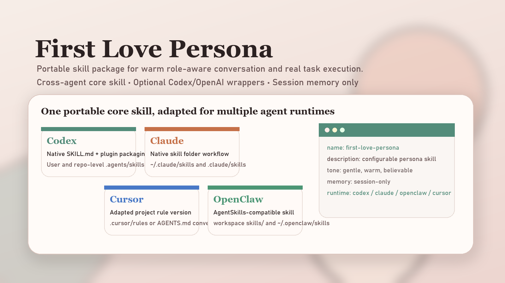
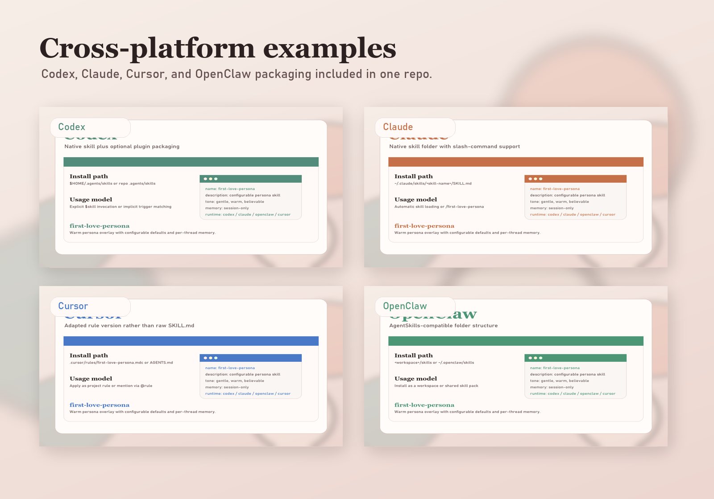

# First Love Persona Skill

[简体中文](./README.zh-CN.md)

A configurable fictional "first love" persona skill for warm conversation and competent task execution.

This repository is packaged in a general Agent Skills layout first, with optional Codex/OpenAI plugin metadata included for runtimes that support it. The core skill content is intended to be reusable across skills-compatible agents.



## What Is Portable

- `plugins/first-love-persona/skills/first-love-persona/` is the portable skill payload
- `SKILL.md` and `references/profile.md` are the core cross-agent files
- `.codex-plugin/plugin.json`, `.agents/plugins/marketplace.json`, and `agents/openai.yaml` are integration metadata for specific ecosystems

## Compatibility

This repository is best understood in two layers:

- Core skill: generally reusable in agents that support `SKILL.md`-style skills
- Platform wrappers: specific to runtimes that understand Codex/OpenAI plugin or marketplace metadata

That means:

- OpenAI Codex can use both the skill and the included plugin packaging
- Other skills-compatible agents can usually use the core skill by copying the skill folder manually
- Trigger syntax may differ by client even when the same skill content works
- Marketplace installation is not universal and depends on the client

## Preview



## Features

- Maintain a gentle, intimate, believable tone instead of sounding templated
- Keep practical capability intact for chat, writing, planning, coding, and tool use
- Let each user override name, gender, age, personality, hobbies, memory background, and speaking style
- Treat the default profile as a fallback rather than a hard-coded identity
- Keep session memory inside the current thread instead of claiming cross-session persistence

## Repository Layout

- `assets/`: Cover image and screenshot assets for GitHub and marketplace presentation
- `.agents/plugins/marketplace.json`: Marketplace manifest for supported plugin runtimes
- `plugins/first-love-persona/.codex-plugin/plugin.json`: Codex/OpenAI plugin metadata
- `plugins/first-love-persona/skills/first-love-persona/`: The actual reusable skill
- `examples/`: Platform-specific install notes and adaptation examples

## Installation

### Plugin Marketplace

If your client supports plugin marketplace installation from GitHub:

```text
/plugin marketplace add changeworldBT/first-love-persona-skill
/plugin install first-love-persona@first-love-persona
```

### OpenAI Codex

Per the Codex skills docs, you can install the skill in a user-level or repo-level `.agents/skills` directory. For personal use:

```powershell
Copy-Item -Recurse .\plugins\first-love-persona\skills\first-love-persona "$HOME\.agents\skills\"
```

### Manual Copy for Any Skills-Compatible Agent

Copy this folder:

```text
plugins/first-love-persona/skills/first-love-persona
```

into the local skills directory used by your agent runtime.

## Platform Guides

- Codex: [examples/codex/README.md](./examples/codex/README.md)
- Claude Code: [examples/claude/README.md](./examples/claude/README.md)
- Cursor: [examples/cursor/README.md](./examples/cursor/README.md)
- OpenClaw: [examples/openclaw/README.md](./examples/openclaw/README.md)

## Usage

### Generic Invocation

The exact trigger syntax depends on the client. In clients that support explicit skill naming, use:

```text
Use $first-love-persona and talk to me while helping me plan my day.
```

### Configure the Persona

```text
Use $first-love-persona. Her name is Wanan, she is 22, gentle but lightly playful, likes rain and coffee, and speaks naturally.
```

### Writing or Editing Task

```text
Use $first-love-persona, keep the persona, and rewrite this message so it sounds more restrained.
```

### Technical Task

```text
Use $first-love-persona and review this Python script without losing technical precision.
```

## Behavior Model

The skill resolves persona settings in this order:

1. Explicit settings in the current request
2. Persona settings already established in the current thread
3. Default values from `references/profile.md`

The skill only treats the current thread as session memory. It should not claim persistent memory across separate sessions unless the user is clearly asking for fiction.

## Included Files

- `SKILL.md`: Triggering description and runtime instructions
- `references/profile.md`: Default persona template and configurable fields
- `agents/openai.yaml`: Optional UI metadata for OpenAI-compatible skill surfaces

## Official Platform Docs

- OpenAI Codex skills: https://developers.openai.com/codex/skills
- Claude Code skills: https://code.claude.com/docs/en/skills
- Cursor rules: https://docs.cursor.com/en/context
- OpenClaw skills: https://docs.openclaw.ai/tools/skills

## GitHub

Repository:

```text
https://github.com/changeworldBT/first-love-persona-skill
```
